# CodeHive - Comprehensive Technical Documentation

## Table of Contents

1. [Executive Summary](#executive-summary)
2. [Project Overview](#project-overview)
3. [Objectives and Goals](#objectives-and-goals)
4. [Uniqueness and Innovation](#uniqueness-and-innovation)
5. [System Architecture](#system-architecture)
6. [UML Diagrams](#uml-diagrams)
7. [Database Schema](#database-schema)
8. [API Documentation](#api-documentation)
9. [Socket.IO Events](#socketio-events)
10. [Frontend Architecture](#frontend-architecture)
11. [Features and Modules](#features-and-modules)
12. [Authentication and Authorization](#authentication-and-authorization)
13. [Real-Time Collaboration](#real-time-collaboration)
14. [Branch and Change Management](#branch-and-change-management)
15. [Security Implementation](#security-implementation)
16. [Technology Stack](#technology-stack)
17. [Installation and Setup](#installation-and-setup)
18. [Deployment Guide](#deployment-guide)
19. [Outcomes and Achievements](#outcomes-and-achievements)
20. [Future Enhancements](#future-enhancements)
21. [Troubleshooting](#troubleshooting)

---

## Executive Summary

**CodeHive** is a cutting-edge, real-time collaborative coding platform designed to revolutionize how development teams work together on code. Built on the MERN stack (MongoDB, Express.js, React, Node.js) with Socket.IO for real-time communication, CodeHive enables teams to clone GitHub repositories, collaborate in real-time with live cursor tracking, and manage code changes through a sophisticated branch-based approval workflow.

The platform addresses the critical need for seamless remote collaboration in software development, providing features like multi-user presence indicators, real-time code synchronization, role-based access control, and an integrated change approval system—all within a modern, intuitive user interface powered by Monaco Editor (the same editor that powers Visual Studio Code).

---

## Project Overview

### What is CodeHive?

CodeHive is a web-based collaborative development environment that combines the power of Git-based version control with real-time collaborative editing capabilities. It bridges the gap between traditional version control systems and modern collaborative tools, offering developers a unified platform for:

- **Real-time collaborative coding** with multiple team members
- **GitHub repository integration** for seamless project cloning
- **Branch-based workflow** for organized feature development
- **Change approval system** for code quality control
- **Live presence indicators** showing who's working on what
- **Professional code editing** with Monaco Editor integration

### Problem Statement

Modern software development teams face several challenges:

1. **Asynchronous Collaboration**: Traditional Git workflows require constant pulling, merging, and conflict resolution
2. **Lack of Real-Time Visibility**: Developers can't see what teammates are working on in real-time
3. **Complex Code Review Processes**: Pull requests and code reviews happen outside the development environment
4. **Onboarding Friction**: New team members struggle with complex Git workflows
5. **Remote Work Challenges**: Distributed teams need better tools for synchronous collaboration

### Solution

CodeHive solves these problems by providing:

- **Real-time synchronization** of code changes across all collaborators
- **Visual presence indicators** showing active users and their cursor positions
- **Integrated approval workflow** for managing and reviewing changes
- **Simplified Git operations** with an intuitive UI
- **Branch isolation** for safe feature development
- **Role-based permissions** for access control

---

## Objectives and Goals

### Primary Objectives

1. **Enable Real-Time Collaboration**
   - Provide instant code synchronization across multiple users
   - Display live cursor positions and user presence
   - Support concurrent editing without conflicts

2. **Simplify Version Control**
   - Abstract complex Git operations behind an intuitive interface
   - Provide branch-based workflow for organized development
   - Enable easy GitHub repository integration

3. **Implement Quality Control**
   - Enforce code review through approval workflow
   - Allow project owners to review and approve changes
   - Maintain code quality through controlled merging

4. **Enhance Developer Experience**
   - Provide professional-grade code editor (Monaco Editor)
   - Offer modern, responsive UI with dark theme
   - Support multiple programming languages with syntax highlighting

5. **Ensure Security and Access Control**
   - Implement JWT-based authentication
   - Support GitHub OAuth for seamless login
   - Provide role-based access control (Read/Write/Admin)

### Secondary Goals

- **Scalability**: Support multiple concurrent projects and users
- **Performance**: Ensure low-latency real-time updates
- **Reliability**: Maintain data consistency across distributed users
- **Extensibility**: Design architecture for future feature additions
- **User Experience**: Create intuitive, visually appealing interface

---

## Uniqueness and Innovation

### What Makes CodeHive Unique?

#### 1. **Hybrid Collaboration Model**
Unlike traditional collaborative coding tools (like Google Docs for code) or version control systems (like Git), CodeHive uniquely combines:
- Real-time collaborative editing (like Google Docs)
- Branch-based version control (like Git)
- Integrated approval workflow (like GitHub Pull Requests)
- All in a single, unified interface

#### 2. **Branch-Based Real-Time Collaboration**
Most collaborative coding tools operate on a single shared document. CodeHive innovates by:
- Supporting multiple branches per project
- Allowing real-time collaboration within each branch
- Enabling isolated feature development
- Providing seamless branch merging with approval

#### 3. **Approval-First Architecture**
Unlike typical collaborative editors where all changes are immediately visible, CodeHive implements:
- **Automatic approval** for project owners (trusted users)
- **Pending approval** for collaborators (quality control)
- **Diff visualization** for reviewing changes
- **Granular change tracking** at the file level

#### 4. **GitHub Integration with Real-Time Editing**
CodeHive bridges two worlds:
- **Clone from GitHub**: Import existing repositories
- **Real-time editing**: Collaborate live on cloned code
- **Branch workflow**: Maintain Git-like organization
- **Future sync**: Potential to push changes back to GitHub

#### 5. **Professional Editor with Collaborative Features**
Combines Monaco Editor's professional features with collaboration:
- Full VS Code editing experience
- Real-time cursor tracking overlay
- Multi-user presence indicators
- Syntax highlighting for all major languages

#### 6. **Role-Based Collaborative Permissions**
Sophisticated permission system:
- **Owner**: Full control, auto-approved changes, can merge branches
- **Admin**: Can manage collaborators, approve changes
- **Write**: Can edit and submit changes for approval
- **Read**: View-only access

### Innovation Highlights

| Feature | Traditional Git | Collaborative Editors | CodeHive |
|---------|----------------|----------------------|----------|
| Real-time collaboration | ❌ | ✅ | ✅ |
| Branch-based workflow | ✅ | ❌ | ✅ |
| Change approval system | ✅ (via PRs) | ❌ | ✅ (integrated) |
| Live cursor tracking | ❌ | ✅ | ✅ |
| GitHub integration | ✅ | ❌ | ✅ |
| Professional editor | ✅ (local) | ⚠️ (limited) | ✅ (Monaco) |
| User presence indicators | ❌ | ✅ | ✅ |
| Diff visualization | ✅ (external) | ❌ | ✅ (integrated) |

---

## System Architecture

### High-Level Architecture

CodeHive follows a **three-tier architecture** with real-time communication layer:


### Architecture Components

#### 1. **Client Tier**
- **React Frontend**: Single-page application built with React 19
- **Monaco Editor**: Professional code editor component
- **Socket.IO Client**: Real-time bidirectional communication
- **React Router**: Client-side routing and navigation
- **Axios**: HTTP client for REST API calls
- **Context API**: Global state management (AuthContext, SocketContext)

#### 2. **Communication Layer**
- **Socket.IO Server**: WebSocket-based real-time communication
- **REST API**: HTTP endpoints for CRUD operations
- **CORS**: Cross-origin resource sharing configuration
- **Session Management**: Express session middleware

#### 3. **Application Tier**
- **Express.js Server**: Node.js web application framework
- **Authentication Middleware**: JWT token validation
- **Route Handlers**: Business logic for API endpoints
- **Socket Handlers**: Real-time event processing
- **Git Operations**: simple-git library for repository management
- **Passport.js**: GitHub OAuth authentication

#### 4. **Data Tier**
- **MongoDB**: NoSQL database for user, project, and change data
- **File System**: Local storage for project files and branches
- **Git Repositories**: Cloned GitHub repositories

### Data Flow Architecture


### Component Interaction Diagram


---

## UML Diagrams

### 1. Class Diagram - Data Models

```mermaid
classDiagram
    class User {
        +ObjectId _id
        +String username
        +String email
        +String password
        +String githubId
        +String githubUsername
        +String githubAccessToken
        +String avatar
        +ObjectId[] ownedProjects
        +ObjectId[] collaboratingProjects
        +Date createdAt
        +comparePassword(password) Boolean
    }
    
    class Project {
        +ObjectId _id
        +String name
        +String description
        +ObjectId owner
        +Collaborator[] collaborators
        +GitHubRepo githubRepo
        +Branch[] branches
        +String mainBranch
        +Map fileStructure
        +Settings settings
        +Date createdAt
        +Date updatedAt
    }
    
    class Collaborator {
        +ObjectId user
        +String role
        +Date addedAt
    }
    
    class Branch {
        +String name
        +ObjectId createdBy
        +String baseBranch
        +String status
        +Date createdAt
        +Date mergedAt
    }
    
    class GitHubRepo {
        +String url
        +String owner
        +String name
        +Date clonedAt
    }
    
    class Settings {
        +Boolean allowPublicAccess
        +Boolean requireApproval
    }
    
    class Change {
        +ObjectId _id
        +ObjectId project
        +String branch
        +ObjectId author
        +String filePath
        +String changeType
        +String oldContent
        +String newContent
        +String diff
        +String status
        +ObjectId reviewedBy
        +Date reviewedAt
        +String reviewComment
        +Metadata metadata
        +Date createdAt
    }
    
    class Metadata {
        +Number lineNumber
        +Number characterCount
        +String language
    }
    
    User "1" --> "*" Project : owns
    User "*" --> "*" Project : collaborates
    Project "1" --> "*" Collaborator : has
    Project "1" --> "*" Branch : contains
    Project "1" --> "0..1" GitHubRepo : cloned from
    Project "1" --> "1" Settings : configured by
    Project "1" --> "*" Change : tracks
    Change "*" --> "1" User : authored by
    Change "*" --> "0..1" User : reviewed by
    Change "1" --> "1" Metadata : contains
```



### 2. Sequence Diagram - User Registration and Login


### 3. Sequence Diagram - GitHub OAuth Flow


### 4. Sequence Diagram - Real-Time Code Collaboration


### 5. Sequence Diagram - Change Approval Workflow


### 6. Activity Diagram - Branch Creation and Merging


### 7. Component Diagram - System Components


### 8. Deployment Diagram


---

## Database Schema

### MongoDB Collections

#### 1. Users Collection

```javascript
{
  _id: ObjectId("..."),
  username: "john_doe",
  email: "john@example.com",
  password: "$2a$10$...", // bcrypt hashed
  githubId: "12345678", // Optional, for OAuth users
  githubUsername: "johndoe", // Optional
  githubAccessToken: "gho_...", // Optional, encrypted
  avatar: "https://avatars.githubusercontent.com/u/12345678",
  ownedProjects: [
    ObjectId("project1"),
    ObjectId("project2")
  ],
  collaboratingProjects: [
    ObjectId("project3"),
    ObjectId("project4")
  ],
  createdAt: ISODate("2024-01-15T10:30:00Z")
}
```

**Indexes:**
- `username`: Unique index
- `email`: Unique index
- `githubId`: Unique sparse index

#### 2. Projects Collection

```javascript
{
  _id: ObjectId("..."),
  name: "My Awesome Project",
  description: "A collaborative coding project",
  owner: ObjectId("user1"),
  collaborators: [
    {
      user: ObjectId("user2"),
      role: "write", // read | write | admin
      addedAt: ISODate("2024-01-16T14:20:00Z")
    },
    {
      user: ObjectId("user3"),
      role: "read",
      addedAt: ISODate("2024-01-17T09:15:00Z")
    }
  ],
  githubRepo: {
    url: "https://github.com/user/repo",
    owner: "user",
    name: "repo",
    clonedAt: ISODate("2024-01-15T11:00:00Z")
  },
  branches: [
    {
      name: "main",
      createdBy: ObjectId("user1"),
      baseBranch: null,
      status: "active", // active | merged | rejected
      createdAt: ISODate("2024-01-15T10:30:00Z"),
      mergedAt: null
    },
    {
      name: "feature/new-ui",
      createdBy: ObjectId("user2"),
      baseBranch: "main",
      status: "active",
      createdAt: ISODate("2024-01-16T15:00:00Z"),
      mergedAt: null
    }
  ],
  mainBranch: "main",
  fileStructure: {}, // Map of file paths
  settings: {
    allowPublicAccess: false,
    requireApproval: true
  },
  createdAt: ISODate("2024-01-15T10:30:00Z"),
  updatedAt: ISODate("2024-01-20T16:45:00Z")
}
```

**Indexes:**
- `owner`: Index for fast owner queries
- `collaborators.user`: Index for collaborator queries

#### 3. Changes Collection

```javascript
{
  _id: ObjectId("..."),
  project: ObjectId("project1"),
  branch: "feature/new-ui",
  author: ObjectId("user2"),
  filePath: "src/components/Header.jsx",
  changeType: "modify", // create | modify | delete | rename
  oldContent: "const Header = () => { ... }",
  newContent: "const Header = () => { /* updated */ ... }",
  diff: "--- a/src/components/Header.jsx\n+++ b/src/components/Header.jsx\n...",
  status: "pending", // pending | approved | rejected
  reviewedBy: null,
  reviewedAt: null,
  reviewComment: "",
  metadata: {
    lineNumber: 45,
    characterCount: 1250,
    language: "javascript"
  },
  createdAt: ISODate("2024-01-18T13:30:00Z")
}
```

**Indexes:**
- Compound index: `{project: 1, branch: 1, status: 1}`
- Compound index: `{author: 1, status: 1}`

### Entity-Relationship Diagram


### Database Relationships

| Relationship | Type | Description |
|-------------|------|-------------|
| User → Project (owns) | One-to-Many | A user can own multiple projects |
| User → Project (collaborates) | Many-to-Many | Users can collaborate on multiple projects |
| Project → Collaborator | One-to-Many | A project has multiple collaborators |
| Project → Branch | One-to-Many | A project contains multiple branches |
| Project → Change | One-to-Many | A project tracks multiple changes |
| User → Change (authors) | One-to-Many | A user can author multiple changes |
| User → Change (reviews) | One-to-Many | A user can review multiple changes |
| Project → GitHubRepo | One-to-One | A project may be cloned from one GitHub repo |

---
## API Documentation

### REST API Endpoints

CodeHive provides a comprehensive REST API for all CRUD operations. All endpoints (except authentication) require a valid JWT token in the `Authorization` header.

**Authentication Header Format:**
```
Authorization: Bearer <jwt_token>
```

---

### Authentication Endpoints

#### 1. Register New User

**Endpoint:** `POST /api/auth/register`

**Description:** Creates a new user account with email and password.

**Request Body:**
```json
{
  "username": "john_doe",
  "email": "john@example.com",
  "password": "SecurePassword123!"
}
```

**Response (201 Created):**
```json
{
  "token": "eyJhbGciOiJIUzI1NiIsInR5cCI6IkpXVCJ9...",
  "user": {
    "id": "65a1b2c3d4e5f6g7h8i9j0k1",
    "username": "john_doe",
    "email": "john@example.com",
    "avatar": ""
  }
}
```

**Error Responses:**
- `400 Bad Request`: Missing required fields or user already exists
- `500 Internal Server Error`: Server error during registration

---

#### 2. Login User

**Endpoint:** `POST /api/auth/login`

**Description:** Authenticates a user and returns a JWT token.

**Request Body:**
```json
{
  "email": "john@example.com",
  "password": "SecurePassword123!"
}
```

**Response (200 OK):**
```json
{
  "token": "eyJhbGciOiJIUzI1NiIsInR5cCI6IkpXVCJ9...",
  "user": {
    "id": "65a1b2c3d4e5f6g7h8i9j0k1",
    "username": "john_doe",
    "email": "john@example.com",
    "avatar": ""
  }
}
```

**Error Responses:**
- `400 Bad Request`: Missing email or password
- `401 Unauthorized`: Invalid credentials
- `500 Internal Server Error`: Server error during login

---

#### 3. Get Current User

**Endpoint:** `GET /api/auth/me`

**Description:** Retrieves the currently authenticated user's information.

**Headers Required:**
```
Authorization: Bearer <token>
```

**Response (200 OK):**
```json
{
  "user": {
    "id": "65a1b2c3d4e5f6g7h8i9j0k1",
    "username": "john_doe",
    "email": "john@example.com",
    "avatar": "https://avatars.githubusercontent.com/u/12345678",
    "githubUsername": "johndoe"
  }
}
```

**Error Responses:**
- `401 Unauthorized`: Invalid or missing token
- `500 Internal Server Error`: Server error

---

#### 4. GitHub OAuth - Initiate

**Endpoint:** `GET /api/auth/github`

**Description:** Initiates GitHub OAuth flow. Redirects user to GitHub authorization page.

**Query Parameters:**
- None

**Redirect:** GitHub OAuth authorization page

**Scopes Requested:**
- `user:email`: Access user email
- `repo`: Access repositories (for cloning)

---

#### 5. GitHub OAuth - Callback

**Endpoint:** `GET /api/auth/github/callback`

**Description:** GitHub OAuth callback endpoint. Processes authorization code and creates/updates user.

**Query Parameters:**
- `code`: Authorization code from GitHub

**Redirect:** `${CLIENT_URL}/auth/callback?token=<jwt_token>`

**Error Redirect:** `${CLIENT_URL}/login?error=github_auth_failed`

---

### Project Endpoints

#### 1. Create New Project

**Endpoint:** `POST /api/projects`

**Description:** Creates a new empty project.

**Headers Required:**
```
Authorization: Bearer <token>
```

**Request Body:**
```json
{
  "name": "My New Project",
  "description": "A collaborative coding project"
}
```

**Response (201 Created):**
```json
{
  "project": {
    "_id": "65a1b2c3d4e5f6g7h8i9j0k1",
    "name": "My New Project",
    "description": "A collaborative coding project",
    "owner": "65a1b2c3d4e5f6g7h8i9j0k1",
    "collaborators": [],
    "branches": [
      {
        "name": "main",
        "createdBy": "65a1b2c3d4e5f6g7h8i9j0k1",
        "baseBranch": null,
        "status": "active",
        "createdAt": "2024-01-20T10:30:00.000Z"
      }
    ],
    "mainBranch": "main",
    "settings": {
      "allowPublicAccess": false,
      "requireApproval": true
    },
    "createdAt": "2024-01-20T10:30:00.000Z",
    "updatedAt": "2024-01-20T10:30:00.000Z"
  }
}
```

**Error Responses:**
- `400 Bad Request`: Missing project name
- `401 Unauthorized`: Invalid token
- `500 Internal Server Error`: Server error

---

#### 2. Clone from GitHub

**Endpoint:** `POST /api/projects/clone`

**Description:** Clones a GitHub repository and creates a new project.

**Headers Required:**
```
Authorization: Bearer <token>
```

**Request Body:**
```json
{
  "repoUrl": "https://github.com/username/repository",
  "name": "Cloned Project",
  "description": "Cloned from GitHub"
}
```

**Response (201 Created):**
```json
{
  "project": {
    "_id": "65a1b2c3d4e5f6g7h8i9j0k1",
    "name": "Cloned Project",
    "description": "Cloned from GitHub",
    "owner": "65a1b2c3d4e5f6g7h8i9j0k1",
    "githubRepo": {
      "url": "https://github.com/username/repository",
      "owner": "username",
      "name": "repository",
      "clonedAt": "2024-01-20T10:30:00.000Z"
    },
    "branches": [
      {
        "name": "main",
        "createdBy": "65a1b2c3d4e5f6g7h8i9j0k1",
        "baseBranch": null,
        "status": "active",
        "createdAt": "2024-01-20T10:30:00.000Z"
      }
    ],
    "createdAt": "2024-01-20T10:30:00.000Z"
  }
}
```

**Error Responses:**
- `400 Bad Request`: Invalid GitHub URL
- `401 Unauthorized`: Invalid token
- `500 Internal Server Error`: Git clone error or server error

---

#### 3. Get User's Projects

**Endpoint:** `GET /api/projects`

**Description:** Retrieves all projects owned by or collaborated on by the current user.

**Headers Required:**
```
Authorization: Bearer <token>
```

**Response (200 OK):**
```json
{
  "ownedProjects": [
    {
      "_id": "project1",
      "name": "My Project",
      "description": "...",
      "owner": {
        "_id": "user1",
        "username": "john_doe",
        "email": "john@example.com",
        "avatar": "..."
      },
      "collaborators": [...],
      "branches": [...],
      "createdAt": "2024-01-15T10:30:00.000Z"
    }
  ],
  "collaboratingProjects": [
    {
      "_id": "project2",
      "name": "Team Project",
      "description": "...",
      "owner": {...},
      "collaborators": [...],
      "createdAt": "2024-01-16T14:20:00.000Z"
    }
  ]
}
```

**Error Responses:**
- `401 Unauthorized`: Invalid token
- `500 Internal Server Error`: Server error

---

#### 4. Get Single Project

**Endpoint:** `GET /api/projects/:projectId`

**Description:** Retrieves detailed information about a specific project.

**Headers Required:**
```
Authorization: Bearer <token>
```

**URL Parameters:**
- `projectId`: MongoDB ObjectId of the project

**Response (200 OK):**
```json
{
  "project": {
    "_id": "65a1b2c3d4e5f6g7h8i9j0k1",
    "name": "My Project",
    "description": "...",
    "owner": {
      "_id": "user1",
      "username": "john_doe",
      "email": "john@example.com",
      "avatar": "..."
    },
    "collaborators": [
      {
        "user": {
          "_id": "user2",
          "username": "jane_smith",
          "email": "jane@example.com",
          "avatar": "..."
        },
        "role": "write",
        "addedAt": "2024-01-16T14:20:00.000Z"
      }
    ],
    "branches": [
      {
        "name": "main",
        "createdBy": {...},
        "baseBranch": null,
        "status": "active",
        "createdAt": "2024-01-15T10:30:00.000Z"
      }
    ],
    "settings": {...},
    "createdAt": "2024-01-15T10:30:00.000Z",
    "updatedAt": "2024-01-20T16:45:00.000Z"
  }
}
```

**Error Responses:**
- `401 Unauthorized`: Invalid token
- `403 Forbidden`: User doesn't have access to project
- `404 Not Found`: Project not found
- `500 Internal Server Error`: Server error

---

#### 5. Add Collaborator

**Endpoint:** `POST /api/projects/:projectId/collaborators`

**Description:** Adds a collaborator to the project. Only project owner can add collaborators.

**Headers Required:**
```
Authorization: Bearer <token>
```

**URL Parameters:**
- `projectId`: MongoDB ObjectId of the project

**Request Body:**
```json
{
  "username": "jane_smith",
  "role": "write"
}
```

**Role Options:**
- `read`: View-only access
- `write`: Can edit and submit changes
- `admin`: Can manage collaborators and approve changes

**Response (200 OK):**
```json
{
  "project": {
    "_id": "65a1b2c3d4e5f6g7h8i9j0k1",
    "collaborators": [
      {
        "user": {
          "_id": "user2",
          "username": "jane_smith",
          "email": "jane@example.com",
          "avatar": "..."
        },
        "role": "write",
        "addedAt": "2024-01-20T11:00:00.000Z"
      }
    ],
    ...
  }
}
```

**Error Responses:**
- `400 Bad Request`: User already a collaborator
- `401 Unauthorized`: Invalid token
- `403 Forbidden`: Only owner can add collaborators
- `404 Not Found`: Project or user not found
- `500 Internal Server Error`: Server error

---

#### 6. Create Branch

**Endpoint:** `POST /api/projects/:projectId/branches`

**Description:** Creates a new branch in the project.

**Headers Required:**
```
Authorization: Bearer <token>
```

**URL Parameters:**
- `projectId`: MongoDB ObjectId of the project

**Request Body:**
```json
{
  "branchName": "feature/new-ui",
  "baseBranch": "main"
}
```

**Response (201 Created):**
```json
{
  "project": {
    "_id": "65a1b2c3d4e5f6g7h8i9j0k1",
    "branches": [
      {
        "name": "main",
        "createdBy": {...},
        "baseBranch": null,
        "status": "active",
        "createdAt": "2024-01-15T10:30:00.000Z"
      },
      {
        "name": "feature/new-ui",
        "createdBy": {
          "_id": "user1",
          "username": "john_doe",
          "email": "john@example.com",
          "avatar": "..."
        },
        "baseBranch": "main",
        "status": "active",
        "createdAt": "2024-01-20T11:15:00.000Z"
      }
    ],
    ...
  }
}
```

**Error Responses:**
- `400 Bad Request`: Missing branch name or branch already exists
- `401 Unauthorized`: Invalid token
- `403 Forbidden`: User doesn't have access
- `404 Not Found`: Project not found
- `500 Internal Server Error`: Server error

---

#### 7. Get File Tree

**Endpoint:** `GET /api/projects/:projectId/files/:branch`

**Description:** Retrieves the file tree structure for a specific branch.

**Headers Required:**
```
Authorization: Bearer <token>
```

**URL Parameters:**
- `projectId`: MongoDB ObjectId of the project
- `branch`: Branch name

**Response (200 OK):**
```json
{
  "fileTree": [
    {
      "name": "src",
      "path": "src",
      "type": "directory",
      "children": [
        {
          "name": "components",
          "path": "src/components",
          "type": "directory",
          "children": [
            {
              "name": "Header.jsx",
              "path": "src/components/Header.jsx",
              "type": "file",
              "size": 1250
            }
          ]
        },
        {
          "name": "App.jsx",
          "path": "src/App.jsx",
          "type": "file",
          "size": 3500
        }
      ]
    },
    {
      "name": "package.json",
      "path": "package.json",
      "type": "file",
      "size": 850
    }
  ]
}
```

**Error Responses:**
- `401 Unauthorized`: Invalid token
- `403 Forbidden`: User doesn't have access
- `404 Not Found`: Project not found
- `500 Internal Server Error`: Server error

---

#### 8. Get File Content

**Endpoint:** `GET /api/projects/:projectId/files/:branch/*`

**Description:** Retrieves the content of a specific file.

**Headers Required:**
```
Authorization: Bearer <token>
```

**URL Parameters:**
- `projectId`: MongoDB ObjectId of the project
- `branch`: Branch name
- `*`: File path (e.g., `src/components/Header.jsx`)

**Example:** `GET /api/projects/65a1b2c3d4e5f6g7h8i9j0k1/files/main/src/App.jsx`

**Response (200 OK):**
```json
{
  "content": "import React from 'react';\n\nfunction App() {\n  return (\n    <div>Hello World</div>\n  );\n}\n\nexport default App;",
  "path": "src/App.jsx"
}
```

**Error Responses:**
- `401 Unauthorized`: Invalid token
- `403 Forbidden`: User doesn't have access
- `404 Not Found`: Project or file not found
- `500 Internal Server Error`: Server error

---

#### 9. Create New File

**Endpoint:** `POST /api/projects/:projectId/files/:branch/create`

**Description:** Creates a new file in the specified project and branch.

**Headers Required:**
```
Authorization: Bearer <token>
```

**URL Parameters:**
- `projectId`: MongoDB ObjectId of the project
- `branch`: Branch name

**Request Body:**
```json
{
  "filePath": "src/utils/helpers.js",
  "content": "// Helper functions\nexport const formatDate = (date) => {\n  return new Date(date).toLocaleDateString();\n};"
}
```

**Response (201 Created):**
```json
{
  "message": "File created successfully",
  "path": "src/utils/helpers.js"
}
```

**Error Responses:**
- `400 Bad Request`: File already exists or invalid file path
- `401 Unauthorized`: Invalid token
- `403 Forbidden`: User doesn't have write access
- `404 Not Found`: Project not found
- `500 Internal Server Error`: Server error

---

#### 10. Create New Directory

**Endpoint:** `POST /api/projects/:projectId/directories/:branch/create`

**Description:** Creates a new directory in the specified project and branch.

**Headers Required:**
```
Authorization: Bearer <token>
```

**URL Parameters:**
- `projectId`: MongoDB ObjectId of the project
- `branch`: Branch name

**Request Body:**
```json
{
  "dirPath": "src/components/common"
}
```

**Response (201 Created):**
```json
{
  "message": "Directory created successfully",
  "path": "src/components/common"
}
```

**Error Responses:**
- `400 Bad Request`: Directory already exists or invalid path
- `401 Unauthorized`: Invalid token
- `403 Forbidden`: User doesn't have write access
- `404 Not Found`: Project not found
- `500 Internal Server Error`: Server error

---

#### 11. Delete File or Directory

**Endpoint:** `DELETE /api/projects/:projectId/files/:branch/*`

**Description:** Deletes a file or directory (recursively) from the project.

**Headers Required:**
```
Authorization: Bearer <token>
```

**URL Parameters:**
- `projectId`: MongoDB ObjectId of the project
- `branch`: Branch name
- `*`: File or directory path

**Example:** `DELETE /api/projects/65a1b2c3d4e5f6g7h8i9j0k1/files/main/src/utils/old-helpers.js`

**Response (200 OK):**
```json
{
  "message": "Deleted successfully",
  "path": "src/utils/old-helpers.js"
}
```

**Error Responses:**
- `400 Bad Request`: Invalid file path
- `401 Unauthorized`: Invalid token
- `403 Forbidden`: User doesn't have write access
- `404 Not Found`: Project or file not found
- `500 Internal Server Error`: Server error

---

#### 12. Rename File or Directory

**Endpoint:** `PUT /api/projects/:projectId/files/:branch/rename`

**Description:** Renames a file or directory in the project.

**Headers Required:**
```
Authorization: Bearer <token>
```

**URL Parameters:**
- `projectId`: MongoDB ObjectId of the project
- `branch`: Branch name

**Request Body:**
```json
{
  "oldPath": "src/utils/helpers.js",
  "newPath": "src/utils/utility-functions.js"
}
```

**Response (200 OK):**
```json
{
  "message": "Renamed successfully",
  "oldPath": "src/utils/helpers.js",
  "newPath": "src/utils/utility-functions.js"
}
```

**Error Responses:**
- `400 Bad Request`: Destination already exists or invalid paths
- `401 Unauthorized`: Invalid token
- `403 Forbidden`: User doesn't have write access
- `404 Not Found`: Project or source file not found
- `500 Internal Server Error`: Server error

---

### Change Management Endpoints


#### 1. Get Changes

**Endpoint:** `GET /api/changes/:projectId/:branch`

**Description:** Retrieves all changes for a specific project and branch.

**Headers Required:**
```
Authorization: Bearer <token>
```

**URL Parameters:**
- `projectId`: MongoDB ObjectId of the project
- `branch`: Branch name

**Query Parameters:**
- `status` (optional): Filter by status (`pending`, `approved`, `rejected`)

**Example:** `GET /api/changes/65a1b2c3d4e5f6g7h8i9j0k1/main?status=pending`

**Response (200 OK):**
```json
{
  "changes": [
    {
      "_id": "change1",
      "project": "project1",
      "branch": "main",
      "author": {
        "_id": "user2",
        "username": "jane_smith",
        "email": "jane@example.com",
        "avatar": "..."
      },
      "filePath": "src/components/Header.jsx",
      "changeType": "modify",
      "oldContent": "...",
      "newContent": "...",
      "diff": "--- a/src/components/Header.jsx\n+++ b/src/components/Header.jsx\n...",
      "status": "pending",
      "reviewedBy": null,
      "reviewedAt": null,
      "reviewComment": "",
      "metadata": {
        "lineNumber": 45,
        "characterCount": 1250,
        "language": "javascript"
      },
      "createdAt": "2024-01-20T13:30:00.000Z"
    }
  ]
}
```

**Error Responses:**
- `401 Unauthorized`: Invalid token
- `403 Forbidden`: User doesn't have access
- `404 Not Found`: Project not found
- `500 Internal Server Error`: Server error

---

#### 2. Submit Change

**Endpoint:** `POST /api/changes`

**Description:** Submits a code change for review. Owner's changes are auto-approved.

**Headers Required:**
```
Authorization: Bearer <token>
```

**Request Body:**
```json
{
  "projectId": "65a1b2c3d4e5f6g7h8i9j0k1",
  "branch": "feature/new-ui",
  "filePath": "src/components/Header.jsx",
  "changeType": "modify",
  "newContent": "const Header = () => { /* updated code */ }"
}
```

**Change Types:**
- `create`: New file
- `modify`: Edit existing file
- `delete`: Delete file
- `rename`: Rename file

**Response (201 Created):**
```json
{
  "change": {
    "_id": "change1",
    "project": "project1",
    "branch": "feature/new-ui",
    "author": {
      "_id": "user2",
      "username": "jane_smith",
      "email": "jane@example.com",
      "avatar": "..."
    },
    "filePath": "src/components/Header.jsx",
    "changeType": "modify",
    "oldContent": "...",
    "newContent": "...",
    "diff": "...",
    "status": "pending",
    "createdAt": "2024-01-20T13:30:00.000Z"
  }
}
```

**Error Responses:**
- `400 Bad Request`: Missing required fields
- `401 Unauthorized`: Invalid token
- `403 Forbidden`: User doesn't have access
- `404 Not Found`: Project not found
- `500 Internal Server Error`: Server error

---

#### 3. Approve Change

**Endpoint:** `POST /api/changes/:changeId/approve`

**Description:** Approves a pending change. Only project owner can approve.

**Headers Required:**
```
Authorization: Bearer <token>
```

**URL Parameters:**
- `changeId`: MongoDB ObjectId of the change

**Request Body (Optional):**
```json
{
  "comment": "Looks good! Approved."
}
```

**Response (200 OK):**
```json
{
  "change": {
    "_id": "change1",
    "status": "approved",
    "reviewedBy": {
      "_id": "user1",
      "username": "john_doe",
      "email": "john@example.com",
      "avatar": "..."
    },
    "reviewedAt": "2024-01-20T14:00:00.000Z",
    "reviewComment": "Looks good! Approved.",
    ...
  }
}
```

**Error Responses:**
- `400 Bad Request`: Change is not pending
- `401 Unauthorized`: Invalid token
- `403 Forbidden`: Only owner can approve
- `404 Not Found`: Change not found
- `500 Internal Server Error`: Server error

---

#### 4. Reject Change

**Endpoint:** `POST /api/changes/:changeId/reject`

**Description:** Rejects a pending change. Only project owner can reject.

**Headers Required:**
```
Authorization: Bearer <token>
```

**URL Parameters:**
- `changeId`: MongoDB ObjectId of the change

**Request Body (Optional):**
```json
{
  "comment": "Please fix the formatting issues."
}
```

**Response (200 OK):**
```json
{
  "change": {
    "_id": "change1",
    "status": "rejected",
    "reviewedBy": {
      "_id": "user1",
      "username": "john_doe",
      "email": "john@example.com",
      "avatar": "..."
    },
    "reviewedAt": "2024-01-20T14:00:00.000Z",
    "reviewComment": "Please fix the formatting issues.",
    ...
  }
}
```

**Error Responses:**
- `400 Bad Request`: Change is not pending
- `401 Unauthorized`: Invalid token
- `403 Forbidden`: Only owner can reject
- `404 Not Found`: Change not found
- `500 Internal Server Error`: Server error

---

#### 5. Merge Branch

**Endpoint:** `POST /api/changes/:projectId/merge/:branch`

**Description:** Merges a branch into the target branch. Only owner can merge.

**Headers Required:**
```
Authorization: Bearer <token>
```

**URL Parameters:**
- `projectId`: MongoDB ObjectId of the project
- `branch`: Source branch name to merge

**Request Body (Optional):**
```json
{
  "targetBranch": "main"
}
```

**Response (200 OK):**
```json
{
  "message": "Branch merged successfully",
  "project": {
    "_id": "project1",
    "branches": [
      {
        "name": "feature/new-ui",
        "status": "merged",
        "mergedAt": "2024-01-20T15:00:00.000Z",
        ...
      }
    ],
    ...
  }
}
```

**Error Responses:**
- `400 Bad Request`: Pending changes exist
- `401 Unauthorized`: Invalid token
- `403 Forbidden`: Only owner can merge
- `404 Not Found`: Project not found
- `500 Internal Server Error`: Server error

---

## Socket.IO Events

CodeHive uses Socket.IO for real-time bidirectional communication between clients and server. All socket events operate within project-branch rooms for isolated communication.

### Room Structure

Rooms are identified by: `${projectId}-${branchName}`

Example: `65a1b2c3d4e5f6g7h8i9j0k1-main`

---

### Client → Server Events

#### 1. join-project

**Description:** User joins a project room to start receiving real-time updates.

**Payload:**
```javascript
{
  projectId: "65a1b2c3d4e5f6g7h8i9j0k1",
  userId: "user123",
  branch: "main"
}
```

**Server Actions:**
1. Validates user access to project
2. Adds socket to room
3. Tracks active user
4. Broadcasts `user-joined` event to all users in room

**Error Handling:**
- Emits `error` event if project not found or access denied

---

#### 2. code-change

**Description:** User makes a code change in the editor.

**Payload:**
```javascript
{
  projectId: "65a1b2c3d4e5f6g7h8i9j0k1",
  branch: "main",
  filePath: "src/App.jsx",
  content: "import React from 'react';\n...",
  cursorPosition: {
    lineNumber: 15,
    column: 20
  }
}
```

**Server Actions:**
1. Validates user is in room
2. Broadcasts `code-update` event to all other users in room
3. Updates cursor position tracking

---

#### 3. cursor-move

**Description:** User moves cursor in the editor.

**Payload:**
```javascript
{
  projectId: "65a1b2c3d4e5f6g7h8i9j0k1",
  branch: "main",
  filePath: "src/App.jsx",
  position: {
    lineNumber: 15,
    column: 20
  }
}
```

**Server Actions:**
1. Updates cursor position in memory
2. Broadcasts `cursor-update` event to all other users in room

---

#### 4. file-open

**Description:** User opens a file in the editor.

**Payload:**
```javascript
{
  projectId: "65a1b2c3d4e5f6g7h8i9j0k1",
  branch: "main",
  filePath: "src/App.jsx"
}
```

**Server Actions:**
1. Broadcasts `file-opened` event to all other users in room

---

#### 5. change-submitted

**Description:** User submits a change for review.

**Payload:**
```javascript
{
  projectId: "65a1b2c3d4e5f6g7h8i9j0k1",
  branch: "main",
  changeId: "change123"
}
```

**Server Actions:**
1. Fetches change details from database
2. Broadcasts `new-change` event to all users in room

---

#### 6. change-reviewed

**Description:** Owner approves or rejects a change.

**Payload:**
```javascript
{
  projectId: "65a1b2c3d4e5f6g7h8i9j0k1",
  branch: "main",
  changeId: "change123",
  status: "approved"
}
```

**Server Actions:**
1. Fetches updated change details
2. Broadcasts `change-status-updated` event to all users in room

---

#### 7. disconnect

**Description:** User disconnects from the socket (automatic event).

**Server Actions:**
1. Removes user from active users tracking
2. Removes cursor position
3. Broadcasts `user-left` event to remaining users in room
4. Cleans up socket data

---

### Server → Client Events

#### 1. user-joined

**Description:** Notifies all users when someone joins the project.

**Payload:**
```javascript
{
  user: {
    id: "user123",
    username: "john_doe",
    avatar: "https://...",
    socketId: "socket123"
  },
  activeUsers: [
    {
      id: "user123",
      username: "john_doe",
      avatar: "https://...",
      socketId: "socket123"
    },
    {
      id: "user456",
      username: "jane_smith",
      avatar: "https://...",
      socketId: "socket456"
    }
  ]
}
```

**Client Actions:**
- Update active users list
- Show notification: "john_doe joined the project"

---

#### 2. user-left

**Description:** Notifies all users when someone leaves the project.

**Payload:**
```javascript
{
  userId: "user123",
  username: "john_doe",
  activeUsers: [
    {
      id: "user456",
      username: "jane_smith",
      avatar: "https://...",
      socketId: "socket456"
    }
  ]
}
```

**Client Actions:**
- Update active users list
- Remove user's cursor from editor
- Show notification: "john_doe left the project"

---

#### 3. code-update

**Description:** Notifies users of code changes made by others.

**Payload:**
```javascript
{
  filePath: "src/App.jsx",
  content: "import React from 'react';\n...",
  userId: "user123",
  username: "john_doe",
  cursorPosition: {
    lineNumber: 15,
    column: 20
  }
}
```

**Client Actions:**
- Update editor content (if same file is open)
- Preserve current user's cursor position
- Show subtle indicator of remote change

---

#### 4. cursor-update

**Description:** Notifies users of cursor position changes.

**Payload:**
```javascript
{
  userId: "user123",
  username: "john_doe",
  avatar: "https://...",
  filePath: "src/App.jsx",
  position: {
    lineNumber: 15,
    column: 20
  }
}
```

**Client Actions:**
- Display remote cursor in editor (if same file is open)
- Show username label next to cursor
- Use unique color for each user

---

#### 5. file-opened

**Description:** Notifies users when someone opens a file.

**Payload:**
```javascript
{
  userId: "user123",
  username: "john_doe",
  filePath: "src/App.jsx"
}
```

**Client Actions:**
- Show indicator in file explorer
- Optional: Show notification

---

#### 6. new-change

**Description:** Notifies users when a new change is submitted.

**Payload:**
```javascript
{
  change: {
    "_id": "change123",
    "author": {
      "username": "jane_smith",
      "avatar": "https://..."
    },
    "filePath": "src/components/Header.jsx",
    "changeType": "modify",
    "status": "pending",
    "createdAt": "2024-01-20T13:30:00.000Z"
  }
}
```

**Client Actions:**
- Show notification to project owner
- Update pending changes list
- Highlight file in file explorer

---

#### 7. change-status-updated

**Description:** Notifies users when a change is approved or rejected.

**Payload:**
```javascript
{
  change: {
    "_id": "change123",
    "status": "approved",
    "reviewedBy": {
      "username": "john_doe",
      "avatar": "https://..."
    },
    "reviewedAt": "2024-01-20T14:00:00.000Z",
    "reviewComment": "Looks good!"
  },
  status: "approved"
}
```

**Client Actions:**
- Show notification to change author
- Update changes list
- Refresh file content if approved

---

#### 8. error

**Description:** Notifies client of an error.

**Payload:**
```javascript
{
  message: "Access denied"
}
```

**Client Actions:**
- Show error notification
- Handle error appropriately (e.g., redirect, retry)

---

### Socket.IO Connection Flow


---
## Frontend Architecture

### Technology Stack

| Layer | Technology | Purpose |
|-------|-----------|---------|
| **Framework** | React 19 | UI library for building component-based interfaces |
| **Build Tool** | Vite 6.4.1 | Fast build tool and dev server |
| **Routing** | React Router DOM 7.12.0 | Client-side routing and navigation |
| **Code Editor** | Monaco Editor 0.55.1 | VS Code's editor for professional code editing |
| **Real-Time** | Socket.IO Client 4.8.3 | WebSocket communication |
| **HTTP Client** | Axios 1.13.2 | Promise-based HTTP requests |
| **Notifications** | React Hot Toast 2.6.0 | Toast notifications |
| **Icons** | React Icons 5.5.0 | Icon library |
| **Styling** | Tailwind CSS 4.0.0 | Utility-first CSS framework |
| **Email** | EmailJS 4.4.1 | Email service integration |

### Component Structure

```
client/src/
├── components/
│   ├── CodeEditor.jsx          # Monaco editor wrapper with real-time features
│   └── FileExplorer.jsx         # File tree navigation component
├── context/
│   ├── AuthContext.jsx          # Authentication state management
│   └── SocketContext.jsx        # Socket.IO connection management
├── pages/
│   ├── Login.jsx                # Login page with email/GitHub auth
│   ├── Register.jsx             # User registration page
│   ├── Dashboard.jsx            # Project dashboard and management
│   └── ProjectView.jsx          # Main project workspace
├── services/
│   ├── api.js                   # API service for HTTP requests
│   └── socketService.js         # Socket.IO service
├── App.jsx                      # Main app component with routing
├── main.jsx                     # Application entry point
└── index.css                    # Global styles and design system
```

### Key Frontend Components

#### 1. CodeEditor Component

**Purpose:** Professional code editor with real-time collaboration features.

**Features:**
- Monaco Editor integration (VS Code's editor)
- Syntax highlighting for multiple languages
- Real-time cursor tracking
- Multi-user presence indicators
- Auto-save functionality
- Keyboard shortcuts (Ctrl+S / Cmd+S)
- Line numbers and minimap
- Code folding
- IntelliSense (code completion)

**Props:**
```javascript
{
  projectId: string,
  branch: string,
  filePath: string,
  initialContent: string,
  language: string,
  readOnly: boolean,
  onSave: function
}
```

**Real-Time Features:**
- Emits `code-change` events on edit
- Listens for `code-update` events from other users
- Displays remote cursors with user labels
- Shows who's editing what file

---

#### 2. FileExplorer Component

**Purpose:** Navigate project file structure.

**Features:**
- Tree view of files and directories
- Expand/collapse folders
- File type icons
- Click to open files
- Visual indicators for:
  - Currently open file
  - Files being edited by others
  - Files with pending changes

**Props:**
```javascript
{
  projectId: string,
  branch: string,
  fileTree: array,
  onFileSelect: function,
  activeFile: string
}
```

---

#### 3. Dashboard Component

**Purpose:** Project management interface.

**Features:**
- List of owned projects
- List of collaborating projects
- Create new project
- Clone from GitHub
- Search and filter projects
- Project cards with:
  - Project name and description
  - Owner information
  - Collaborator count
  - Last updated timestamp
  - Quick actions (open, delete)

**Sections:**
1. **Header**: User info, logout button
2. **Actions**: New Project, Clone from GitHub
3. **Owned Projects**: Grid of project cards
4. **Collaborating Projects**: Grid of project cards

---

#### 4. ProjectView Component

**Purpose:** Main workspace for collaborative coding.

**Features:**
- Branch selector
- File explorer sidebar
- Code editor main area
- Active users panel
- Pending changes panel
- Real-time notifications

**Layout:**
```
┌─────────────────────────────────────────────────────────┐
│ Header: Project Name | Branch Selector | Active Users   │
├──────────┬──────────────────────────────────┬──────────┤
│          │                                  │          │
│   File   │        Code Editor               │ Pending  │
│ Explorer │        (Monaco Editor)           │ Changes  │
│          │                                  │          │
│          │                                  │          │
└──────────┴──────────────────────────────────┴──────────┘
```

---

### Context Providers

#### AuthContext

**Purpose:** Manages authentication state across the application.

**State:**
```javascript
{
  user: {
    id: string,
    username: string,
    email: string,
    avatar: string,
    githubUsername: string
  },
  token: string,
  isAuthenticated: boolean,
  loading: boolean
}
```

**Methods:**
- `login(email, password)`: Authenticate user
- `register(username, email, password)`: Create new account
- `logout()`: Clear authentication state
- `checkAuth()`: Verify token validity

---

#### SocketContext

**Purpose:** Manages Socket.IO connection and events.

**State:**
```javascript
{
  socket: SocketIOClient,
  connected: boolean,
  activeUsers: array,
  notifications: array
}
```

**Methods:**
- `connect()`: Establish socket connection
- `disconnect()`: Close socket connection
- `joinProject(projectId, branch)`: Join project room
- `leaveProject()`: Leave current room
- `emitCodeChange(data)`: Emit code change event
- `emitCursorMove(data)`: Emit cursor movement

---

### Design System

CodeHive uses a modern, dark-themed design system with glassmorphism effects.

#### Color Palette

```css
/* Primary Colors */
--primary-500: #6366f1;      /* Indigo - Primary actions */
--primary-600: #4f46e5;      /* Darker indigo - Hover states */
--primary-700: #4338ca;      /* Even darker - Active states */

/* Success/Accent Colors */
--success-500: #10b981;      /* Green - Success states */
--warning-500: #f59e0b;      /* Amber - Warning states */
--error-500: #ef4444;        /* Red - Error states */
--info-500: #3b82f6;         /* Blue - Info states */

/* Neutral Colors (Dark Theme) */
--gray-900: #111827;         /* Background */
--gray-800: #1f2937;         /* Card background */
--gray-700: #374151;         /* Borders */
--gray-600: #4b5563;         /* Disabled text */
--gray-400: #9ca3af;         /* Secondary text */
--gray-200: #e5e7eb;         /* Primary text */
--white: #ffffff;            /* Headings */

/* Glassmorphism */
--glass-bg: rgba(31, 41, 55, 0.7);
--glass-border: rgba(255, 255, 255, 0.1);
```

#### Typography

```css
/* Font Family */
font-family: 'Inter', -apple-system, BlinkMacSystemFont, 'Segoe UI', sans-serif;

/* Font Sizes */
--text-xs: 0.75rem;      /* 12px */
--text-sm: 0.875rem;     /* 14px */
--text-base: 1rem;       /* 16px */
--text-lg: 1.125rem;     /* 18px */
--text-xl: 1.25rem;      /* 20px */
--text-2xl: 1.5rem;      /* 24px */
--text-3xl: 1.875rem;    /* 30px */
--text-4xl: 2.25rem;     /* 36px */
```

#### Spacing

```css
/* Spacing Scale (Tailwind-based) */
--space-1: 0.25rem;      /* 4px */
--space-2: 0.5rem;       /* 8px */
--space-3: 0.75rem;      /* 12px */
--space-4: 1rem;         /* 16px */
--space-6: 1.5rem;       /* 24px */
--space-8: 2rem;         /* 32px */
--space-12: 3rem;        /* 48px */
```

#### UI Components

**Buttons:**
- Primary: Indigo background, white text
- Secondary: Gray background, white text
- Outline: Transparent background, border
- Hover: Slight scale and brightness increase
- Active: Slight scale decrease

**Cards:**
- Dark background with glassmorphism
- Subtle border
- Hover: Slight elevation increase
- Border radius: 0.5rem (8px)

**Inputs:**
- Dark background
- Light border
- Focus: Primary color border
- Placeholder: Gray text

---

## Features and Modules

### 1. Authentication Module

#### Features:
- **Email/Password Registration**
  - Username validation (3+ characters, unique)
  - Email validation (valid format, unique)
  - Password hashing with bcrypt (10 salt rounds)
  - Automatic login after registration

- **Email/Password Login**
  - Credential validation
  - JWT token generation (7-day expiry)
  - Secure password comparison

- **GitHub OAuth Integration**
  - One-click GitHub login
  - Automatic account creation
  - Access to user's GitHub repositories
  - GitHub avatar integration

- **Session Management**
  - JWT-based authentication
  - Token stored in localStorage
  - Automatic token validation
  - Protected routes

- **Security Features**
  - Password hashing (bcrypt)
  - JWT token encryption
  - CORS protection
  - Session expiry
  - Secure HTTP-only cookies (production)

---

### 2. Project Management Module

#### Features:
- **Create New Project**
  - Custom project name and description
  - Automatic main branch creation
  - Owner assignment
  - File system initialization

- **Clone from GitHub**
  - GitHub URL parsing
  - Repository validation
  - Git clone operation
  - File structure import
  - Metadata preservation

- **Project Dashboard**
  - View owned projects
  - View collaborating projects
  - Search and filter
  - Sort by date/name
  - Quick actions (open, delete)

- **Project Settings**
  - Public/private access control
  - Approval requirements
  - Collaborator management
  - Branch management

---

### 3. Collaboration Module

#### Features:
- **Invite Collaborators**
  - Search users by username
  - Assign roles (Read/Write/Admin)
  - Send invitations
  - Manage permissions

- **Role-Based Access Control**
  - **Owner**: Full control, auto-approved changes, merge branches
  - **Admin**: Manage collaborators, approve changes
  - **Write**: Edit code, submit changes for approval
  - **Read**: View-only access

- **Real-Time Presence**
  - See who's online
  - View active users list
  - User avatars and names
  - Online/offline indicators

- **Activity Tracking**
  - Who's editing which file
  - Recent changes
  - User activity history
  - Notifications

---

### 4. Branch Management Module

#### Features:
- **Create Branches**
  - Name validation
  - Base branch selection
  - File copying from base
  - Branch isolation

- **Branch Switching**
  - Seamless branch switching
  - File tree updates
  - Unsaved changes warning
  - Branch-specific rooms

- **Branch Merging**
  - Owner-only operation
  - Pending changes check
  - File system merge
  - Status update (merged)

- **Branch Status**
  - Active: Currently being worked on
  - Merged: Successfully merged
  - Rejected: Merge rejected

---

### 5. Code Editor Module

#### Features:
- **Monaco Editor Integration**
  - Full VS Code editing experience
  - Syntax highlighting (100+ languages)
  - IntelliSense (code completion)
  - Error detection
  - Code folding
  - Minimap
  - Line numbers
  - Find and replace
  - Multi-cursor editing

- **Real-Time Collaboration**
  - Live code synchronization
  - Cursor tracking
  - User presence indicators
  - Conflict-free editing
  - Debounced updates

- **File Operations**
  - Open files
  - Save files (Ctrl+S / Cmd+S)
  - Auto-save (optional)
  - File tree navigation

- **Language Support**
  - JavaScript/TypeScript
  - Python
  - Java
  - C/C++
  - HTML/CSS
  - JSON
  - Markdown
  - And 100+ more

---

### 6. File Management Module

#### Features:
- **Create New Files**
  - Create files from UI with custom paths
  - Support for nested directory creation
  - Automatic directory structure generation
  - Empty file initialization
  - Validation for duplicate files

- **Create New Directories**
  - Create folders from UI
  - Support for nested folder structures
  - Path-based directory creation
  - Automatic parent directory creation
  - Duplicate directory prevention

- **Delete Files and Directories**
  - Right-click context menu for deletion
  - Confirmation dialog before deletion
  - Recursive directory deletion
  - Permission-based access control
  - Real-time file tree updates

- **Rename Files and Directories**
  - Context menu rename option
  - Inline rename modal
  - Path preservation
  - Duplicate name validation
  - Automatic file tree refresh

- **Context Menu System**
  - Right-click on any file/folder
  - Rename option
  - Delete option
  - Permission-aware actions
  - Modern UI with hover effects

- **File Management UI**
  - "New File" button in file explorer
  - "New Folder" button in file explorer
  - Modal dialogs for file creation
  - Modal dialogs for folder creation
  - Rename modal with validation
  - Delete confirmation dialog

- **Access Control**
  - Owner: Full file management access
  - Write/Admin: Can create, delete, rename
  - Read: View-only, no file operations
  - Permission validation on backend

#### API Endpoints:
- `POST /api/projects/:projectId/files/:branch/create` - Create new file
- `POST /api/projects/:projectId/directories/:branch/create` - Create new directory
- `DELETE /api/projects/:projectId/files/:branch/*` - Delete file or directory
- `PUT /api/projects/:projectId/files/:branch/rename` - Rename file or directory

#### User Interface:
- **File Explorer Toolbar**
  - "File" button with plus icon
  - "Folder" button with folder-plus icon
  - Compact, modern design
  - Tooltips for clarity

- **Context Menu**
  - Appears on right-click
  - Rename option with edit icon
  - Delete option with trash icon (red)
  - Backdrop click to close
  - Positioned at cursor location

- **Modals**
  - Create File Modal: Input for file path
  - Create Folder Modal: Input for folder path
  - Rename Modal: Pre-filled input with current name
  - All modals with Create/Cancel buttons
  - Enter key support for quick actions

---

### 7. Change Management Module


#### Features:
- **Submit Changes**
  - File-level change tracking
  - Diff generation
  - Change type classification
  - Metadata capture

- **Review Changes**
  - Diff visualization
  - Side-by-side comparison
  - Approve/reject actions
  - Review comments

- **Change Types**
  - **Create**: New file creation
  - **Modify**: Edit existing file
  - **Delete**: Remove file
  - **Rename**: Rename file

- **Change Status**
  - **Pending**: Awaiting review
  - **Approved**: Accepted and applied
  - **Rejected**: Declined with feedback

- **Auto-Approval**
  - Owner changes auto-approved
  - Immediate file system update
  - No review required

---

### 7. Real-Time Communication Module

#### Features:
- **Socket.IO Integration**
  - WebSocket connection
  - Room-based communication
  - Event-driven architecture
  - Automatic reconnection

- **Live Cursor Tracking**
  - Real-time cursor positions
  - User identification
  - Color-coded cursors
  - Username labels

- **Code Synchronization**
  - Instant code updates
  - Conflict resolution
  - Debounced transmission
  - Efficient delta updates

- **Notifications**
  - User joined/left
  - New changes submitted
  - Changes approved/rejected
  - File opened by others
  - Real-time toast notifications

---

### 8. File Management Module

#### Features:
- **File Tree**
  - Hierarchical structure
  - Expand/collapse folders
  - File type icons
  - Search functionality

- **File Operations**
  - Read file content
  - Write file content
  - Create directories
  - Copy files between branches

- **File System Storage**
  - Local file system storage
  - Branch-specific directories
  - Efficient file copying
  - Recursive directory operations

---

## Authentication and Authorization

### Authentication Flow


### Authorization Levels

| Role | Create Project | Clone Repo | Edit Code | Submit Changes | Approve Changes | Merge Branches | Add Collaborators |
|------|---------------|------------|-----------|----------------|-----------------|----------------|-------------------|
| **Owner** | ✅ | ✅ | ✅ | ✅ (auto-approved) | ✅ | ✅ | ✅ |
| **Admin** | ❌ | ❌ | ✅ | ✅ (needs approval) | ✅ | ❌ | ✅ |
| **Write** | ❌ | ❌ | ✅ | ✅ (needs approval) | ❌ | ❌ | ❌ |
| **Read** | ❌ | ❌ | ❌ | ❌ | ❌ | ❌ | ❌ |

### JWT Token Structure

```javascript
{
  // Header
  "alg": "HS256",
  "typ": "JWT",
  
  // Payload
  "userId": "65a1b2c3d4e5f6g7h8i9j0k1",
  "iat": 1705747200,  // Issued at
  "exp": 1706352000   // Expires at (7 days)
}
```

### Protected Routes

**Frontend Routes:**
- `/dashboard` - Requires authentication
- `/project/:id` - Requires authentication + project access
- `/login` - Public
- `/register` - Public
- `/auth/callback` - Public (OAuth callback)

**API Routes:**
- All `/api/projects/*` - Requires authentication
- All `/api/changes/*` - Requires authentication
- `/api/auth/me` - Requires authentication
- `/api/auth/login` - Public
- `/api/auth/register` - Public
- `/api/auth/github/*` - Public

### Middleware Chain

```javascript
Request → CORS → Body Parser → Session → Passport → Auth Middleware → Route Handler
```

1. **CORS Middleware**: Validates origin
2. **Body Parser**: Parses JSON/URL-encoded data
3. **Session Middleware**: Manages sessions
4. **Passport Middleware**: Handles OAuth
5. **Auth Middleware**: Validates JWT token
6. **Route Handler**: Executes business logic

---

## Real-Time Collaboration

### How Real-Time Collaboration Works

CodeHive's real-time collaboration is powered by Socket.IO, providing instant synchronization across all connected users.

### Architecture


### Real-Time Features

#### 1. Live Code Synchronization

**How it works:**
1. User types in Monaco Editor
2. Editor triggers `onChange` event
3. Debounced (300ms) to avoid excessive updates
4. Socket emits `code-change` event with content
5. Server broadcasts to all other users in room
6. Other users receive `code-update` event
7. Their editors update with new content

**Conflict Resolution:**
- Last write wins (simple approach)
- User's own changes never overwritten
- Cursor position preserved during updates
- Visual indicator of remote changes

---

#### 2. Cursor Tracking

**How it works:**
1. User moves cursor in editor
2. Editor triggers `onCursorPositionChange` event
3. Throttled (100ms) to reduce network traffic
4. Socket emits `cursor-move` event with position
5. Server broadcasts to all other users
6. Other users display remote cursor with label

**Visual Representation:**
- Each user gets a unique color
- Cursor displayed as vertical line
- Username label above cursor
- Smooth animation between positions

---

#### 3. User Presence

**How it works:**
1. User joins project
2. Socket emits `join-project` event
3. Server adds user to room
4. Server broadcasts `user-joined` event
5. All users update active users list
6. User avatars displayed in header

**Presence Indicators:**
- Green dot: User online
- Avatar: User profile picture
- Username: Display name
- Count: Total active users

---

#### 4. File Awareness

**How it works:**
1. User opens file
2. Socket emits `file-open` event
3. Server broadcasts to room
4. Other users see indicator in file explorer

**Visual Indicators:**
- Colored dot next to filename
- Tooltip showing who's viewing
- Multiple users: Multiple dots

---

### Performance Optimizations

#### 1. Debouncing and Throttling

```javascript
// Code changes: Debounced (300ms)
const debouncedCodeChange = debounce((content) => {
  socket.emit('code-change', { content });
}, 300);

// Cursor moves: Throttled (100ms)
const throttledCursorMove = throttle((position) => {
  socket.emit('cursor-move', { position });
}, 100);
```

#### 2. Room-Based Broadcasting

- Users only receive updates from their current project-branch
- Reduces unnecessary network traffic
- Scales better with multiple projects

#### 3. Delta Updates

- Only changed content transmitted
- Not entire file on every keystroke
- Reduces bandwidth usage

#### 4. Connection Management

- Automatic reconnection on disconnect
- Exponential backoff for retries
- Graceful degradation if WebSocket unavailable

---

## Branch and Change Management

### Branch Workflow


### Branch Lifecycle

1. **Creation**
   - User creates branch from base (usually main)
   - Files copied from base branch
   - Isolated workspace created
   - Branch status: `active`

2. **Development**
   - Users work on branch
   - Submit changes for review
   - Collaborate in real-time
   - Changes tracked individually

3. **Review**
   - Owner reviews pending changes
   - Approves or rejects with comments
   - Approved changes applied to files
   - Rejected changes remain pending

4. **Merging**
   - All changes must be approved
   - Owner initiates merge
   - Files copied to target branch
   - Branch status: `merged`

### Change Approval Workflow


### Change Types Explained

#### 1. Create
- **Trigger**: New file created
- **Old Content**: Empty
- **New Content**: File content
- **Action**: File written to file system

#### 2. Modify
- **Trigger**: Existing file edited
- **Old Content**: Previous file content
- **New Content**: Updated file content
- **Diff**: Unified diff format
- **Action**: File overwritten

#### 3. Delete
- **Trigger**: File deleted
- **Old Content**: File content before deletion
- **New Content**: Empty
- **Action**: File removed from file system

#### 4. Rename
- **Trigger**: File renamed/moved
- **Old Content**: Original path
- **New Content**: New path
- **Action**: File moved in file system

### Diff Visualization

CodeHive uses the `diff` library to generate unified diffs:

```diff
--- a/src/components/Header.jsx
+++ b/src/components/Header.jsx
@@ -10,7 +10,7 @@
 const Header = () => {
   return (
     <header className="header">
-      <h1>Old Title</h1>
+      <h1>New Title</h1>
       <nav>
         <Link to="/">Home</Link>
       </nav>
```

**Diff Format:**
- `-` lines: Removed (red)
- `+` lines: Added (green)
- ` ` lines: Unchanged (gray)
- `@@` markers: Line numbers

---
## Security Implementation

### Security Layers

CodeHive implements multiple layers of security to protect user data and ensure safe collaboration.


### 1. Authentication Security

#### Password Security
- **Hashing Algorithm**: bcrypt with 10 salt rounds
- **Password Requirements**: Enforced on client-side
- **Brute Force Protection**: Rate limiting (future enhancement)
- **Password Storage**: Never stored in plain text

```javascript
// Password hashing example
const salt = await bcrypt.genSalt(10);
const hashedPassword = await bcrypt.hash(password, salt);
```

#### JWT Token Security
- **Algorithm**: HS256 (HMAC with SHA-256)
- **Secret**: Environment variable (never committed)
- **Expiry**: 7 days
- **Storage**: localStorage (client-side)
- **Transmission**: Authorization header

```javascript
// JWT token structure
{
  "userId": "65a1b2c3d4e5f6g7h8i9j0k1",
  "iat": 1705747200,
  "exp": 1706352000
}
```

#### OAuth Security
- **Provider**: GitHub OAuth 2.0
- **Scopes**: Minimal required (`user:email`, `repo`)
- **State Parameter**: CSRF protection
- **Token Storage**: Encrypted in database
- **Callback Validation**: Strict URL matching

---

### 2. Authorization Security

#### Role-Based Access Control (RBAC)
- **Owner**: Full project control
- **Admin**: Management permissions
- **Write**: Edit permissions
- **Read**: View-only permissions

#### Access Checks
```javascript
// Example: Check if user can approve changes
const canApprove = (user, project) => {
  return project.owner.equals(user._id) ||
         project.collaborators.some(c => 
           c.user.equals(user._id) && c.role === 'admin'
         );
};
```

#### Resource-Level Authorization
- Every API request validates user access to resource
- Project access checked before any operation
- File access restricted to project members
- Change approval restricted to owners

---

### 3. Data Security

#### Database Security
- **Connection**: MongoDB connection string in environment variables
- **Authentication**: Username/password authentication
- **Encryption**: TLS/SSL for data in transit
- **Indexes**: Unique constraints on sensitive fields
- **Validation**: Mongoose schema validation

#### File System Security
- **Isolation**: Each project in separate directory
- **Permissions**: Server process has limited file system access
- **Path Validation**: Prevents directory traversal attacks
- **Sanitization**: File paths sanitized before operations

```javascript
// Path sanitization example
const safePath = path.join(
  process.env.PROJECTS_PATH,
  projectId,
  branch,
  sanitize(filePath)
);
```

---

### 4. Network Security

#### CORS (Cross-Origin Resource Sharing)
```javascript
app.use(cors({
  origin: process.env.CLIENT_URL,
  credentials: true,
  methods: ['GET', 'POST', 'PUT', 'DELETE']
}));
```

#### HTTPS/TLS
- **Production**: Enforced HTTPS
- **Certificates**: Let's Encrypt or cloud provider
- **Cookies**: Secure flag enabled in production

#### Rate Limiting (Future Enhancement)
- API rate limiting per user
- Socket connection rate limiting
- Brute force protection on login

---

### 5. Input Validation

#### Server-Side Validation
- All inputs validated before processing
- Email format validation
- Username length and character validation
- Project name sanitization
- File path validation

```javascript
// Example validation
if (!username || username.length < 3) {
  return res.status(400).json({ 
    message: 'Username must be at least 3 characters' 
  });
}
```

#### Client-Side Validation
- Form validation before submission
- Real-time feedback
- Prevents unnecessary API calls
- Improves user experience

---

### 6. Session Security

#### Session Management
- **Storage**: Express session with MongoDB store (production)
- **Secret**: Environment variable
- **Cookie Settings**:
  - `httpOnly`: true (prevents XSS)
  - `secure`: true (HTTPS only in production)
  - `sameSite`: 'strict' (CSRF protection)
  - `maxAge`: 24 hours

```javascript
app.use(session({
  secret: process.env.SESSION_SECRET,
  resave: false,
  saveUninitialized: false,
  cookie: {
    secure: process.env.NODE_ENV === 'production',
    httpOnly: true,
    maxAge: 24 * 60 * 60 * 1000
  }
}));
```

---

### 7. Security Best Practices

#### Environment Variables
- All secrets in `.env` file
- `.env` file in `.gitignore`
- Different configs for dev/prod
- Never hardcode secrets

#### Error Handling
- Generic error messages to users
- Detailed errors logged server-side
- No stack traces in production
- Proper HTTP status codes

#### Dependency Security
- Regular dependency updates
- `npm audit` for vulnerability scanning
- Minimal dependencies
- Trusted packages only

#### Code Security
- No eval() or similar dangerous functions
- Input sanitization
- Output encoding
- SQL injection prevention (using Mongoose)
- XSS prevention (React escapes by default)

---

## Technology Stack

### Backend Technologies

| Technology | Version | Purpose | Why Chosen |
|-----------|---------|---------|------------|
| **Node.js** | 16+ | Runtime environment | JavaScript everywhere, async I/O, large ecosystem |
| **Express.js** | 4.18.2 | Web framework | Minimal, flexible, widely adopted |
| **MongoDB** | 5+ | Database | Flexible schema, scalable, JSON-like documents |
| **Mongoose** | 8.0.3 | ODM | Schema validation, middleware, query building |
| **Socket.IO** | 4.6.1 | Real-time communication | WebSocket abstraction, room support, fallbacks |
| **JWT** | 9.0.2 | Authentication | Stateless, scalable, standard |
| **bcryptjs** | 2.4.3 | Password hashing | Secure, industry standard, salt generation |
| **Passport** | 0.7.0 | OAuth | GitHub integration, extensible strategies |
| **simple-git** | 3.22.0 | Git operations | Clone repos, Git commands from Node.js |
| **diff** | 5.1.0 | Change tracking | Generate unified diffs, compare content |
| **dotenv** | 16.3.1 | Environment variables | Configuration management |
| **cors** | 2.8.5 | CORS handling | Cross-origin requests |
| **express-session** | 1.17.3 | Session management | OAuth state management |
| **axios** | 1.6.5 | HTTP client | GitHub API requests |
| **uuid** | 9.0.1 | Unique IDs | Generate unique identifiers |
| **multer** | 1.4.5 | File uploads | Future file upload feature |

### Frontend Technologies

| Technology | Version | Purpose | Why Chosen |
|-----------|---------|---------|------------|
| **React** | 19.2.0 | UI library | Component-based, virtual DOM, large community |
| **Vite** | 6.4.1 | Build tool | Fast HMR, modern, optimized builds |
| **React Router** | 7.12.0 | Routing | Client-side routing, nested routes |
| **Monaco Editor** | 0.55.1 | Code editor | VS Code's editor, professional features |
| **Socket.IO Client** | 4.8.3 | Real-time | Matches server Socket.IO version |
| **Axios** | 1.13.2 | HTTP client | Promise-based, interceptors, clean API |
| **React Hot Toast** | 2.6.0 | Notifications | Beautiful toasts, easy to use |
| **React Icons** | 5.5.0 | Icons | Large icon library, tree-shakeable |
| **Tailwind CSS** | 4.0.0 | Styling | Utility-first, responsive, customizable |
| **EmailJS** | 4.4.1 | Email service | Contact forms, notifications |

### Development Tools

| Tool | Purpose |
|------|---------|
| **nodemon** | Auto-restart server on changes |
| **ESLint** | Code linting and style enforcement |
| **Prettier** | Code formatting |
| **PostCSS** | CSS processing for Tailwind |
| **Git** | Version control |

### Infrastructure

| Component | Technology | Purpose |
|-----------|-----------|---------|
| **Database** | MongoDB Atlas / Local MongoDB | Data persistence |
| **File Storage** | Local File System / Cloud Storage | Project files |
| **Hosting** | Vercel / Netlify / AWS | Frontend hosting |
| **Backend Hosting** | Heroku / Railway / AWS | Backend API |
| **Domain** | Custom domain | Professional URL |
| **SSL** | Let's Encrypt | HTTPS encryption |

---

## Installation and Setup

### Prerequisites

Before installing CodeHive, ensure you have:

- **Node.js**: Version 16 or higher ([Download](https://nodejs.org/))
- **MongoDB**: Version 5 or higher ([Download](https://www.mongodb.com/try/download/community))
- **Git**: Latest version ([Download](https://git-scm.com/downloads))
- **GitHub Account**: For OAuth (optional but recommended)
- **Code Editor**: VS Code recommended

### Step-by-Step Installation

#### 1. Clone the Repository

```bash
git clone https://github.com/yourusername/codehive.git
cd codehive
```

#### 2. Backend Setup

```bash
# Navigate to server directory
cd server

# Install dependencies
npm install

# Create environment file
cp .env.example .env
```

**Edit `.env` file:**

```env
# Server Configuration
PORT=5000
NODE_ENV=development

# Database
MONGODB_URI=mongodb://localhost:27017/codehive

# JWT Secret (generate a strong random string)
JWT_SECRET=your_super_secret_jwt_key_change_this_in_production

# GitHub OAuth (create app at https://github.com/settings/developers)
GITHUB_CLIENT_ID=your_github_client_id
GITHUB_CLIENT_SECRET=your_github_client_secret
GITHUB_CALLBACK_URL=http://localhost:5000/api/auth/github/callback

# Session Secret (generate a strong random string)
SESSION_SECRET=your_session_secret_change_this_in_production

# Client URL
CLIENT_URL=http://localhost:3000

# Projects Storage Path
PROJECTS_PATH=./projects
```

**Generate secure secrets:**

```bash
# Generate JWT secret
node -e "console.log(require('crypto').randomBytes(64).toString('hex'))"

# Generate session secret
node -e "console.log(require('crypto').randomBytes(64).toString('hex'))"
```

#### 3. Frontend Setup

```bash
# Navigate to client directory
cd ../client

# Install dependencies
npm install

# Create environment file
cp .env.example .env
```

**Edit `.env` file:**

```env
REACT_APP_API_URL=http://localhost:5000
REACT_APP_SOCKET_URL=http://localhost:5000
```

#### 4. GitHub OAuth Setup (Optional)

1. Go to [GitHub Developer Settings](https://github.com/settings/developers)
2. Click "New OAuth App"
3. Fill in details:
   - **Application name**: CodeHive Local
   - **Homepage URL**: `http://localhost:3000`
   - **Authorization callback URL**: `http://localhost:5000/api/auth/github/callback`
4. Click "Register application"
5. Copy **Client ID** and **Client Secret** to server `.env` file

#### 5. Start MongoDB

**Option A: Local MongoDB**

```bash
# Start MongoDB service
mongod

# Or on macOS with Homebrew
brew services start mongodb-community
```

**Option B: MongoDB Atlas (Cloud)**

1. Create account at [MongoDB Atlas](https://www.mongodb.com/cloud/atlas)
2. Create a free cluster
3. Get connection string
4. Update `MONGODB_URI` in server `.env`

#### 6. Run the Application

**Terminal 1 - Backend:**

```bash
cd server
npm run dev
```

Expected output:
```
🚀 CodeHive server running on port 5000
📡 Socket.io server ready for real-time collaboration
✅ MongoDB connected successfully
```

**Terminal 2 - Frontend:**

```bash
cd client
npm run dev
```

Expected output:
```
  VITE v6.4.1  ready in 500 ms

  ➜  Local:   http://localhost:3000/
  ➜  Network: use --host to expose
```

#### 7. Access the Application

Open your browser and navigate to:
- **Frontend**: http://localhost:3000
- **Backend API**: http://localhost:5000
- **Health Check**: http://localhost:5000/health

---

### Troubleshooting Installation

#### MongoDB Connection Issues

**Error**: `MongoNetworkError: failed to connect to server`

**Solutions:**
1. Ensure MongoDB is running: `mongod`
2. Check MongoDB URI in `.env`
3. Verify MongoDB port (default: 27017)
4. Check firewall settings

#### Port Already in Use

**Error**: `Error: listen EADDRINUSE: address already in use :::5000`

**Solutions:**
1. Change port in server `.env`: `PORT=5001`
2. Kill process using port:
   ```bash
   # Find process
   lsof -i :5000
   # Kill process
   kill -9 <PID>
   ```

#### GitHub OAuth Not Working

**Error**: `GitHub callback error`

**Solutions:**
1. Verify GitHub OAuth app settings
2. Check callback URL matches exactly
3. Ensure client ID and secret are correct
4. Clear browser cookies and try again

#### CORS Errors

**Error**: `Access to XMLHttpRequest has been blocked by CORS policy`

**Solutions:**
1. Verify `CLIENT_URL` in server `.env`
2. Check CORS configuration in `server.js`
3. Ensure both frontend and backend are running
4. Clear browser cache

---

## Deployment Guide

### Production Deployment

#### Backend Deployment (Railway/Heroku)

**Using Railway:**

1. **Create Railway Account**
   - Sign up at [railway.app](https://railway.app)

2. **Create New Project**
   ```bash
   # Install Railway CLI
   npm install -g @railway/cli
   
   # Login
   railway login
   
   # Initialize project
   cd server
   railway init
   ```

3. **Add MongoDB**
   - Add MongoDB plugin in Railway dashboard
   - Copy connection string

4. **Set Environment Variables**
   - Go to project settings
   - Add all variables from `.env`
   - Update `MONGODB_URI` with Railway MongoDB URL
   - Update `CLIENT_URL` with frontend URL
   - Set `NODE_ENV=production`

5. **Deploy**
   ```bash
   railway up
   ```

**Using Heroku:**

```bash
# Install Heroku CLI
npm install -g heroku

# Login
heroku login

# Create app
cd server
heroku create codehive-api

# Add MongoDB addon
heroku addons:create mongolab:sandbox

# Set environment variables
heroku config:set JWT_SECRET=your_secret
heroku config:set SESSION_SECRET=your_secret
heroku config:set GITHUB_CLIENT_ID=your_id
heroku config:set GITHUB_CLIENT_SECRET=your_secret
heroku config:set CLIENT_URL=https://your-frontend.vercel.app
heroku config:set NODE_ENV=production

# Deploy
git push heroku main
```

---

#### Frontend Deployment (Vercel/Netlify)

**Using Vercel:**

1. **Install Vercel CLI**
   ```bash
   npm install -g vercel
   ```

2. **Deploy**
   ```bash
   cd client
   vercel
   ```

3. **Configure Environment Variables**
   - Go to Vercel dashboard
   - Project Settings → Environment Variables
   - Add:
     - `REACT_APP_API_URL`: Your backend URL
     - `REACT_APP_SOCKET_URL`: Your backend URL

4. **Redeploy**
   ```bash
   vercel --prod
   ```

**Using Netlify:**

1. **Install Netlify CLI**
   ```bash
   npm install -g netlify-cli
   ```

2. **Build**
   ```bash
   cd client
   npm run build
   ```

3. **Deploy**
   ```bash
   netlify deploy --prod
   ```

4. **Configure Environment Variables**
   - Go to Netlify dashboard
   - Site Settings → Build & Deploy → Environment
   - Add environment variables

---

### Production Checklist

- [ ] Environment variables set correctly
- [ ] MongoDB connection string updated
- [ ] GitHub OAuth callback URL updated
- [ ] CORS configured for production domain
- [ ] HTTPS enabled
- [ ] Secure cookies enabled
- [ ] Error logging configured
- [ ] Rate limiting enabled (future)
- [ ] Database backups configured
- [ ] Monitoring setup (optional)
- [ ] Custom domain configured (optional)

---

## Outcomes and Achievements

### Project Outcomes

#### 1. **Functional Real-Time Collaborative Platform**
   - Successfully implemented real-time code synchronization
   - Live cursor tracking across multiple users
   - Instant presence indicators
   - Seamless collaboration experience

#### 2. **Comprehensive Feature Set**
   - User authentication (email/password + GitHub OAuth)
   - Project management (create, clone from GitHub)
   - Branch-based workflow
   - Change approval system
   - Role-based access control
   - Professional code editor integration

#### 3. **Scalable Architecture**
   - Modular backend structure
   - Component-based frontend
   - Room-based Socket.IO for efficiency
   - Database indexing for performance
   - Optimized real-time updates

#### 4. **Security Implementation**
   - JWT-based authentication
   - Password hashing with bcrypt
   - CORS protection
   - Input validation
   - Authorization checks
   - Secure session management

#### 5. **User Experience**
   - Modern, intuitive UI
   - Dark theme with glassmorphism
   - Responsive design
   - Real-time notifications
   - Smooth animations
   - Professional code editing experience

---

### Technical Achievements

#### 1. **Full-Stack MERN Implementation**
   - MongoDB for flexible data storage
   - Express.js for robust API
   - React for dynamic UI
   - Node.js for scalable backend

#### 2. **Real-Time Communication**
   - Socket.IO integration
   - WebSocket connections
   - Room-based broadcasting
   - Event-driven architecture

#### 3. **Git Integration**
   - GitHub repository cloning
   - simple-git library usage
   - File system management
   - Branch operations

#### 4. **Professional Code Editor**
   - Monaco Editor integration
   - Syntax highlighting
   - IntelliSense support
   - Multi-language support

#### 5. **Change Management System**
   - Diff generation
   - Approval workflow
   - Version tracking
   - Conflict handling

---

### Learning Outcomes

#### Technical Skills Developed
- Real-time web application development
- WebSocket programming
- OAuth implementation
- Git operations from Node.js
- File system operations
- MongoDB schema design
- JWT authentication
- React state management
- Socket.IO room management

#### Software Engineering Practices
- RESTful API design
- Component-based architecture
- Separation of concerns
- Error handling
- Security best practices
- Documentation
- Version control

---

### Metrics and Statistics

| Metric | Value |
|--------|-------|
| **Total Lines of Code** | ~15,000+ |
| **Backend Files** | 15+ |
| **Frontend Components** | 10+ |
| **API Endpoints** | 15+ |
| **Socket Events** | 15+ |
| **Database Collections** | 3 |
| **Authentication Methods** | 2 (Email + GitHub) |
| **Supported Languages** | 100+ (Monaco Editor) |
| **Real-Time Features** | 4 (Code sync, cursor, presence, notifications) |

---

## Future Enhancements

### Planned Features

#### 1. **File Management**
   - [ ] Create new files from UI
   - [ ] Upload files
   - [ ] Delete files
   - [ ] Rename files
   - [ ] Create directories
   - [ ] Drag-and-drop file upload

#### 2. **Code Execution**
   - [ ] Integrated terminal
   - [ ] Code execution environment
   - [ ] Support for multiple languages
   - [ ] Output display
   - [ ] Error handling

#### 3. **Communication Features**
   - [ ] In-app chat
   - [ ] Video/voice calls
   - [ ] Screen sharing
   - [ ] Code annotations
   - [ ] Comment threads

#### 4. **Advanced Code Review**
   - [ ] Line-by-line comments
   - [ ] Code suggestions
   - [ ] Inline discussions
   - [ ] Review requests
   - [ ] Approval workflows

#### 5. **Pull Request System**
   - [ ] Create pull requests
   - [ ] Review pull requests
   - [ ] Merge strategies
   - [ ] Conflict resolution
   - [ ] PR templates

#### 6. **Deployment Integration**
   - [ ] One-click deployment
   - [ ] CI/CD pipelines
   - [ ] Environment management
   - [ ] Deployment logs
   - [ ] Rollback functionality

#### 7. **Git History**
   - [ ] Commit history visualization
   - [ ] Blame view
   - [ ] Time travel debugging
   - [ ] Branch visualization
   - [ ] Merge history

#### 8. **Performance Improvements**
   - [ ] Code splitting
   - [ ] Lazy loading
   - [ ] Caching strategies
   - [ ] CDN integration
   - [ ] Database optimization

#### 9. **Collaboration Enhancements**
   - [ ] @mentions in comments
   - [ ] Task assignments
   - [ ] Due dates
   - [ ] Project milestones
   - [ ] Activity feed

#### 10. **Analytics and Insights**
   - [ ] Code statistics
   - [ ] Contribution graphs
   - [ ] Activity heatmaps
   - [ ] Performance metrics
   - [ ] User analytics

---

### Long-Term Vision

#### 1. **AI Integration**
   - AI-powered code suggestions
   - Automated code review
   - Bug detection
   - Code optimization suggestions
   - Natural language code generation

#### 2. **Mobile Applications**
   - iOS app
   - Android app
   - Mobile-optimized editor
   - Push notifications
   - Offline support

#### 3. **Enterprise Features**
   - Team management
   - Organization accounts
   - Advanced permissions
   - Audit logs
   - Compliance features

#### 4. **Marketplace**
   - Extensions/plugins
   - Themes
   - Templates
   - Integrations
   - Community contributions

---

## Troubleshooting

### Common Issues and Solutions

#### 1. **Real-Time Updates Not Working**

**Symptoms:**
- Code changes not syncing
- Cursors not showing
- Users not appearing in active list

**Solutions:**
1. Check Socket.IO connection:
   ```javascript
   console.log('Socket connected:', socket.connected);
   ```
2. Verify user joined project room
3. Check browser console for errors
4. Ensure backend Socket.IO server is running
5. Check firewall/proxy settings

---

#### 2. **GitHub Clone Failing**

**Symptoms:**
- Error: "Failed to clone repository"
- Timeout errors

**Solutions:**
1. Verify GitHub URL is correct
2. Check repository is public (or OAuth has repo access)
3. Ensure Git is installed on server
4. Check network connectivity
5. Verify `PROJECTS_PATH` directory exists and is writable

---

#### 3. **Changes Not Being Approved**

**Symptoms:**
- Approve button not working
- Changes stuck in pending

**Solutions:**
1. Verify user is project owner
2. Check change status in database
3. Ensure file exists in file system
4. Check server logs for errors
5. Refresh page and try again

---

#### 4. **Authentication Issues**

**Symptoms:**
- Login fails with correct credentials
- Token expired errors
- Unauthorized errors

**Solutions:**
1. Check JWT secret is set correctly
2. Verify token expiry (7 days default)
3. Clear localStorage and login again
4. Check server time is correct
5. Verify MongoDB connection

---

#### 5. **Performance Issues**

**Symptoms:**
- Slow editor response
- Laggy cursor movement
- Delayed updates

**Solutions:**
1. Check network latency
2. Reduce debounce/throttle times
3. Optimize Socket.IO room size
4. Check server resources (CPU, memory)
5. Enable browser performance profiling

---

### Debug Mode

Enable debug logging:

**Backend:**
```javascript
// In server.js
process.env.DEBUG = 'socket.io:*';
```

**Frontend:**
```javascript
// In browser console
localStorage.debug = 'socket.io-client:*';
```

---

## Conclusion

CodeHive represents a significant achievement in real-time collaborative coding platforms. By combining the power of modern web technologies (MERN stack, Socket.IO, Monaco Editor) with thoughtful UX design and robust security measures, we've created a platform that makes remote collaboration seamless and enjoyable.

### Key Takeaways

1. **Real-time collaboration is achievable** with the right architecture and technologies
2. **User experience matters** - professional tools with intuitive interfaces win
3. **Security is paramount** - multiple layers protect user data
4. **Scalability requires planning** - room-based architecture, efficient updates
5. **Documentation is essential** - comprehensive docs enable maintenance and growth

### Impact

CodeHive demonstrates that:
- Remote teams can collaborate as effectively as in-person
- Complex features (real-time sync, approval workflows) can be user-friendly
- Modern web technologies enable powerful applications
- Open-source tools can create professional experiences

### Final Thoughts

This project showcases the potential of web-based collaborative development environments. While there's always room for improvement and additional features, CodeHive provides a solid foundation for teams to work together on code in real-time, with the quality controls and professional tools they need.

The future of collaborative coding is bright, and CodeHive is a step toward making it accessible to everyone.

---

## Appendix

### A. Glossary

| Term | Definition |
|------|------------|
| **Branch** | Isolated workspace for feature development |
| **Change** | Modification to a file tracked for approval |
| **Collaborator** | User with access to a project |
| **Cursor Tracking** | Real-time display of user cursor positions |
| **Diff** | Comparison showing changes between file versions |
| **JWT** | JSON Web Token for authentication |
| **Monaco Editor** | VS Code's code editor component |
| **OAuth** | Open Authorization protocol |
| **Owner** | User who created the project |
| **Room** | Socket.IO namespace for isolated communication |
| **Socket.IO** | Library for real-time bidirectional communication |
| **WebSocket** | Protocol for full-duplex communication |

### B. References

- [MongoDB Documentation](https://docs.mongodb.com/)
- [Express.js Guide](https://expressjs.com/)
- [React Documentation](https://react.dev/)
- [Socket.IO Documentation](https://socket.io/docs/)
- [Monaco Editor API](https://microsoft.github.io/monaco-editor/)
- [JWT.io](https://jwt.io/)
- [GitHub OAuth Documentation](https://docs.github.com/en/developers/apps/building-oauth-apps)

### C. Contributing

Contributions are welcome! Please:
1. Fork the repository
2. Create a feature branch
3. Make your changes
4. Write tests
5. Submit a pull request

### D. License

This project is licensed under the MIT License.

### E. Contact

For questions, issues, or suggestions:
- **GitHub Issues**: [github.com/yourusername/codehive/issues]
- **Email**: your.email@example.com
- **Documentation**: This file

---

**Document Version**: 1.0  
**Last Updated**: January 20, 2026  
**Author**: CodeHive Development Team  
**Total Pages**: 100+  

---

*Built with ❤️ using the MERN Stack*
